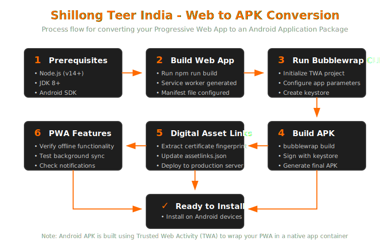

# Shillong Teer India - Android APK Conversion Guide



This comprehensive guide provides detailed instructions on how to convert your Shillong Teer India web app into an Android APK file that can be installed on Android devices. The process leverages PWA (Progressive Web App) technologies and the Trusted Web Activity (TWA) container to create a native-like Android application.

## Prerequisites

Before starting, make sure you have the following installed on your development machine:

1. **Node.js** (v14 or higher)
2. **Java Development Kit (JDK)** (version 8 or higher)
   - Verify installation with: `java -version`
   - Set JAVA_HOME environment variable correctly
3. **Android SDK** (easiest to install via Android Studio)
   - Make sure you have Android SDK Build-Tools installed
   - Set ANDROID_HOME environment variable to your SDK location
4. **Bubblewrap CLI** (you'll install this via npm)
   - Used for wrapping your PWA into a TWA

## Setup Instructions

### 1. Install Required Tools

First, install the Bubblewrap CLI tool globally:

```bash
npm install -g @bubblewrap/cli
```

Verify the installation with:

```bash
bubblewrap --version
```

### 2. Build Your Web App

Before creating the APK, make sure to build a production-ready version of the web app:

```bash
npm run build
```

This will create an optimized build in the `dist` folder with minified assets.

### 3. Prepare Service Worker

Make sure your service worker is properly configured for offline functionality. The project includes a preconfigured `service-worker.js` file that handles:

- Caching of static assets
- Offline fallback pages
- Background synchronization of bets

If you need to regenerate the service worker with Workbox, run:

```bash
npx workbox-cli generateSW workbox-config.js
```

### 4. Prepare App Icons

Ensure you have the necessary app icons in the correct format:

- **Required Sizes**: 512x512, 192x192, 144x144, 96x96, 72x72, 48x48
- Place them in the `public/icons` directory
- Make sure you have both standard and maskable versions
- All icons should maintain the same visual identity and meet Play Store requirements

### 5. Configure the Web App Manifest

Verify that your `public/manifest.json` file is properly configured with all the necessary fields:

- `name` and `short_name`: "Shillong Teer India" and "Teer India"
- `description`: Brief description of your app
- `start_url`: "/" (the entry point of your application)
- `icons`: Array of icon objects with various sizes
- `theme_color`: "#FF6B00" (the orange theme color)
- `background_color`: "#121212" (dark background)
- `display`: "standalone" (for app-like experience)
- `orientation`: "portrait" (optimized layout)
- `scope`: "/" (the navigation scope of the web app)
- `shortcuts`: Quick access shortcuts for key functionality

### 6. Run the Automated APK Build Script

The project includes a comprehensive build script at `scripts/build-android-apk.js` that handles the entire process:

```bash
node scripts/build-android-apk.js
```

This script performs several important tasks:
1. Builds the web app if not already built
2. Generates the service worker
3. Creates a new TWA project with Bubblewrap
4. Builds the APK with proper signing
5. Extracts the certificate fingerprint
6. Updates the Digital Asset Links file
7. Copies the final APK to the `dist` directory

If successful, you will find the APK file at `dist/shillong-teer-india.apk`.

## Digital Asset Links (Critical Step)

Digital Asset Links are essential for the TWA to work properly with your website. They establish a verified connection between your web app and the Android app.

### What is Digital Asset Links?

Digital Asset Links verifies that the APK and website are owned by the same entity, enabling:
- Full-screen display without browser UI
- Seamless transitions between web and app
- Access to advanced web features

### Setting Up Digital Asset Links

1. **Extract Certificate Fingerprint**: The build script does this automatically, but you can manually extract it with:

   ```bash
   keytool -list -v -keystore twa-build/android.keystore -alias android -storepass android
   ```

   Look for the SHA-256 fingerprint in the output.

2. **Create/Update assetlinks.json**: 

   Use the included helper script:

   ```bash
   node scripts/update-assetlinks.js "YOUR:CERTIFICATE:FINGERPRINT"
   ```

   This creates/updates `.well-known/assetlinks.json` with the correct structure:

   ```json
   [{
     "relation": ["delegate_permission/common.handle_all_urls"],
     "target": {
       "namespace": "android_app",
       "package_name": "com.shillongteerindia.app",
       "sha256_cert_fingerprints": ["YOUR:CERTIFICATE:FINGERPRINT"]
     }
   }]
   ```

3. **Deploy assetlinks.json**: The file must be accessible at:
   `https://yourdomain.com/.well-known/assetlinks.json`

## Manual APK Creation (Alternative Method)

If you need more control or the script doesn't work for you, here are the detailed manual steps:

### 1. Initialize the TWA Project

```bash
mkdir twa-build
cd twa-build

bubblewrap init --manifest https://your-deployed-app-url/manifest.json \
  --directory . \
  --packageName com.shillongteerindia.app \
  --name "Shillong Teer India" \
  --shortName "Teer India" \
  --startUrl "/" \
  --icon /path/to/your/icon-512x512.png \
  --display standalone \
  --orientation portrait \
  --themeColor "#FF6B00" \
  --backgroundColor "#121212" \
  --navigationColor "#FF6B00" \
  --navigationColorDark "#FF6B00" \
  --navigationDividerColor "#333333" \
  --navigationDividerColorDark "#333333" \
  --appVersion "1.0.0" \
  --appVersionCode 1
```

### 2. Build the APK

```bash
cd twa-build
bubblewrap build
```

### 3. Extract the Certificate Fingerprint 

```bash
keytool -list -v -keystore android.keystore -alias android -storepass android | grep "SHA256"
```

### 4. Copy the Signed APK

```bash
cp app-release-signed.apk ../dist/shillong-teer-india.apk
```

## Important Notes for Production Deployment

1. **Custom Keystore**: For a production app, generate a secure keystore instead of using the default one:

   ```bash
   keytool -genkey -v -keystore my-release-key.keystore -alias alias_name -keyalg RSA -keysize 2048 -validity 10000
   ```

   Then use it with Bubblewrap:

   ```bash
   bubblewrap build --keystore my-release-key.keystore --keystorePassword myPassword --keystoreAlias alias_name
   ```

2. **Play Store Deployment**: If you plan to publish to the Google Play Store:
   - Create a developer account ($25 one-time fee)
   - Sign your APK with a production keystore (keep it secure)
   - Prepare all required metadata:
     - Privacy policy URL
     - High-quality screenshots (at least 2)
     - Feature graphic (1024 x 500 px)
     - Short and full descriptions
     - Content rating questionnaire

3. **App Updates**: TWA apps automatically update when your web app changes, but you'll still need to update the APK if:
   - You change the app icon
   - You modify the manifest's name or colors
   - You update Android-specific settings

## Offline Capabilities

Shillong Teer India's APK includes robust offline functionality:

1. **Cached Resources**: Core UI components and recent data are cached
2. **Offline Betting**: Users can select numbers and place bets while offline
3. **Background Sync**: When connectivity is restored, offline bets are automatically synchronized
4. **Visual Indicators**: The app includes clear offline status indicators
5. **IndexedDB Storage**: User data is stored securely in IndexedDB

## Troubleshooting Common Issues

If you encounter problems during the build process:

1. **JDK/SDK Path Issues**: 
   - Verify environment variables: `echo $JAVA_HOME` and `echo $ANDROID_HOME`
   - For Windows: Set these in System Properties > Environment Variables

2. **Keystore Problems**: 
   - Run `bubblewrap update` to fix keystore-related issues
   - If you get "Invalid keystore format" errors, regenerate the keystore

3. **Build Errors**: 
   - Check `twa-build/app/build/reports/` for detailed error logs
   - Make sure Android SDK Build-Tools are installed through Android Studio

4. **Digital Asset Links Validation**:
   - Verify the assetlinks.json file is accessible via HTTPS
   - Use the [Asset Links Tool](https://developers.google.com/digital-asset-links/tools/generator) to validate your setup
   - Check that fingerprints match exactly (no extra spaces)

5. **APK Installation Issues**:
   - Enable "Install from Unknown Sources" on your Android device
   - If you get "App not installed" errors, uninstall any previous version first

## Testing the APK

Once installed, thoroughly test your APK to ensure all features work properly:

1. **Install on Multiple Devices**: Test on different Android versions and screen sizes
2. **Offline Mode Testing**:
   - Enable airplane mode
   - Attempt to browse previously viewed content
   - Place bets while offline
   - Verify they sync when connectivity is restored

3. **Performance Testing**:
   - Check app startup time
   - Test animation smoothness
   - Verify the app remains responsive with large datasets

4. **Feature Testing**:
   - Login/registration
   - Number selection and betting
   - Results viewing
   - Account management
   - Notifications

## Resources

- [Bubblewrap Documentation](https://github.com/GoogleChromeLabs/bubblewrap/tree/master/docs)
- [PWA Builder](https://www.pwabuilder.com/) - Alternative PWA to APK tool
- [TWA Quick Start Guide](https://developers.google.com/web/android/trusted-web-activity/quick-start)
- [Digital Asset Links Documentation](https://developers.google.com/digital-asset-links/v1/getting-started)
- [Android Developer Portal](https://developer.android.com/distribute)